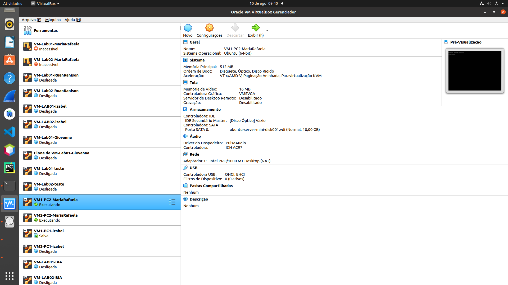
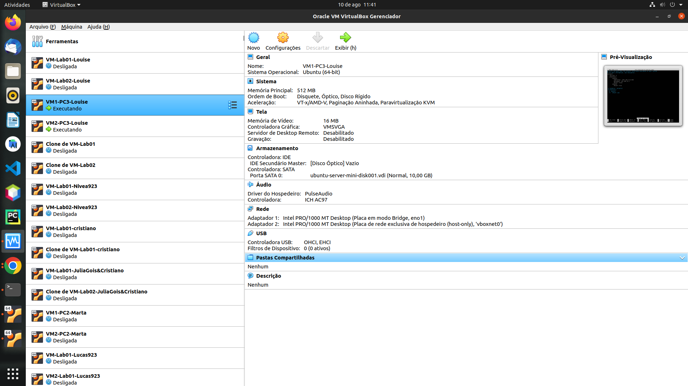
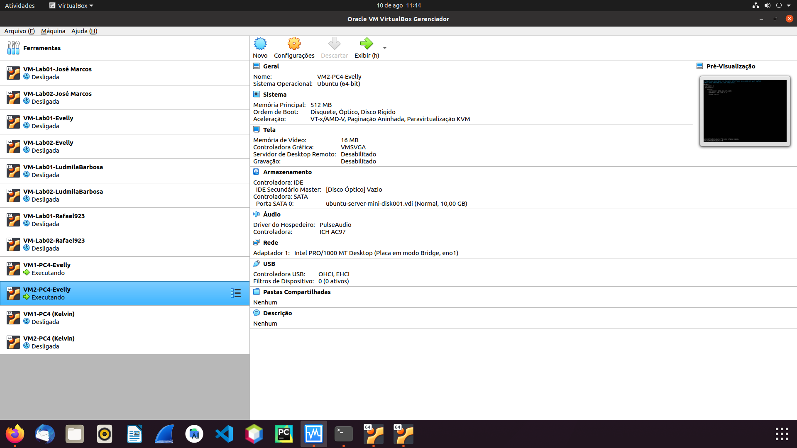

# Ficha técnica das VMs
## PC1
### VM1

 Figura 1:VM1 PC1 Natália

 

### VM2

 Figura 2:VM2 PC1 Natália

 
     
## PC2
### VM1

 Figura 3:VM1 PC2 Rafaela

 

### VM2

 Figura 4:VM2 PC2 Rafaela

     
     
## PC3
### VM1

 Figura 5:VM1 PC3 Louise

 

### VM2

 Figura 6:VM2 PC3 Louise

  
     
## PC4
### VM1

 Figura 7:VM1 PC4 Evelly

 
     
### VM2

 Figura 8:VM2 PC4 Evelly

      
