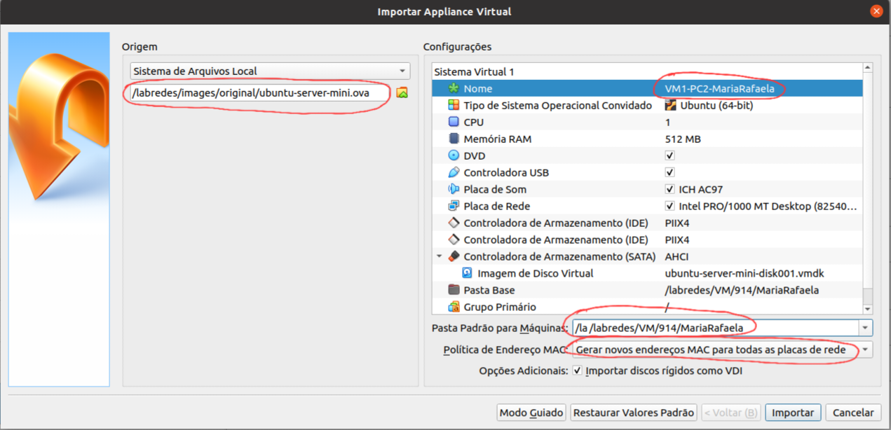

# Roteiro

* Roteiro da criação de um ambiente de rede, no qual contém 8 máquinas virtuais com o S.O. Ubuntu Server.

### Criação das VMs
* importar arquivo ISO
* alterar nome da VM
* selecionar pasta de destino
* gerar novos endereços MAC para todas as placas de rede

 Figura 1: Criação da VM

 

