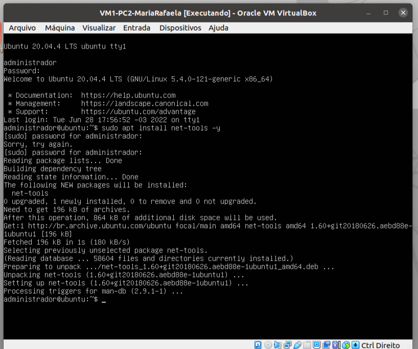
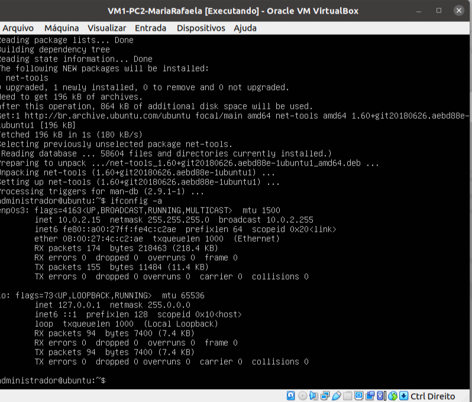
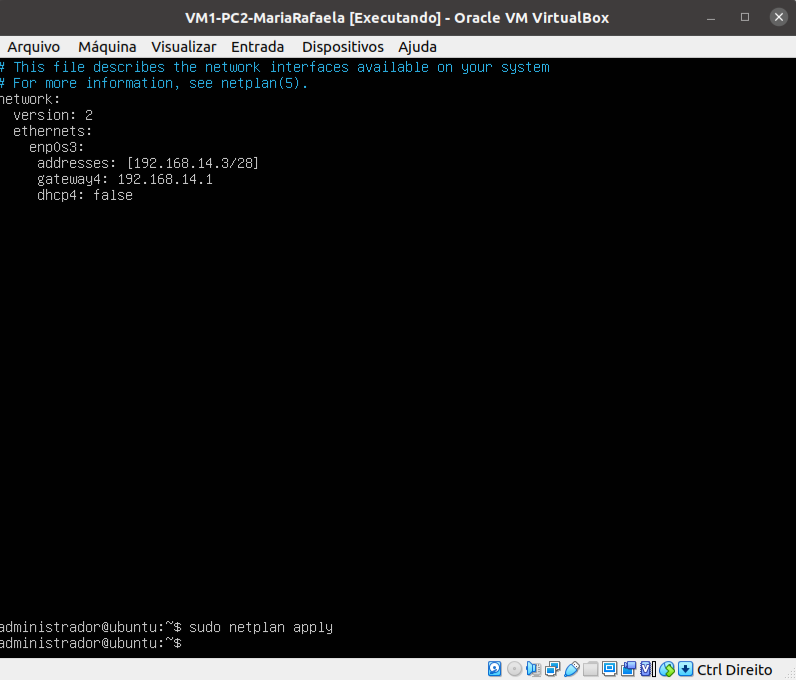
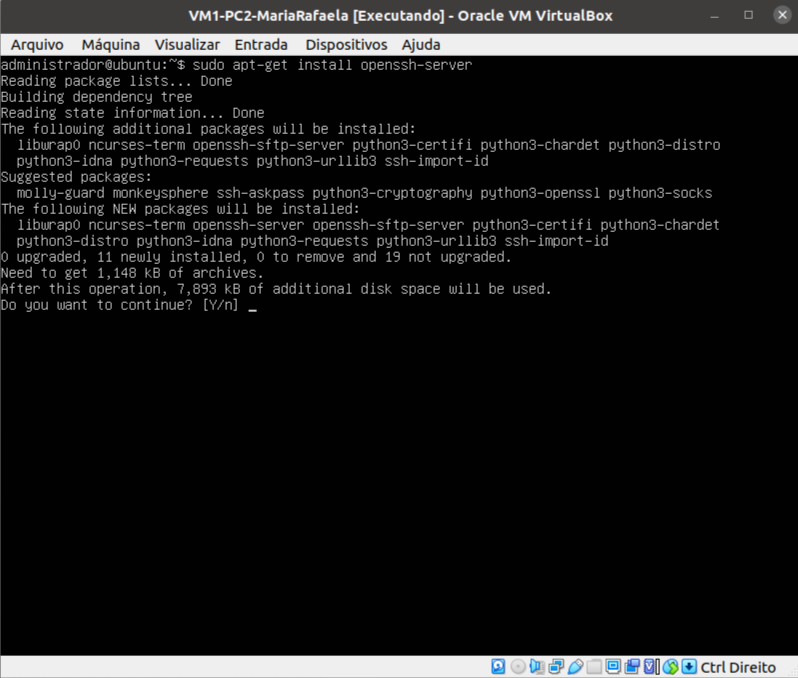
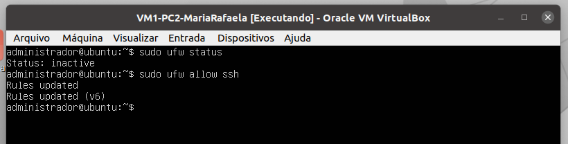
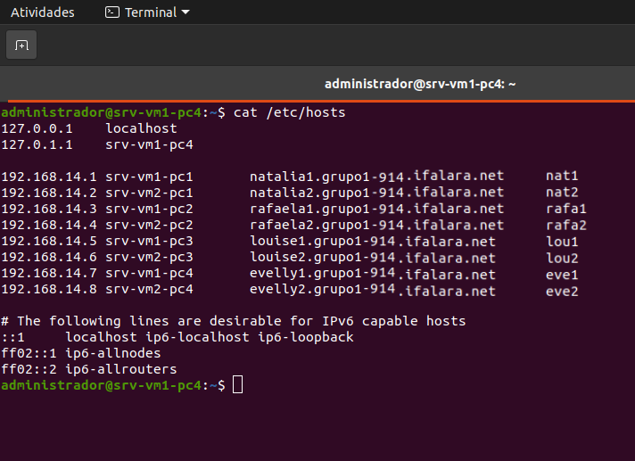

# Roteiro

* Roteiro da criação de um ambiente de rede, no qual contém 8 máquinas virtuais com o S.O. Ubuntu Server.

### Criação das VMs
* importar arquivo .OVA
* alterar nome da VM
* selecionar pasta de destino
* gerar novos endereços MAC para todas as placas de rede

 Figura 1: Criação da VM

 
     
### Instalação das ferramentas de rede na duas VM
* `` sudo apt install net-tools -y``
* ``ifconfig -a``

 Figura 2: Instalando net-tools

 

 Figura 3: ifconfig -a

 

### Configuração das NICs das VMs
* placa de rede no modo rede interna

 Figura 4: Placa como rede interna

 
     
* editar arquivo 01-netcfg.yaml
* ``sudo nano /etc/netplan/01-netcfg.yaml``
* adicionar linhas com o IP e o gateway

 Figura 5: Arquivo 01-netcfg.yaml

 
     
* ``sudo netplan apply``

### Configurando Usuários e Hostnames

 Figura 6: Criando usuários

* ``sudo adduser <usuario>``

 
     
* Deve ser realizada a criação de todos os usuários dos integrantes do grupo em todas as VMs (exemplo abaixo de apenas uma VM, mas isso foi realizado em todas)
* comando para verificação de usuários em uma máquina ``getent passwd``

 Figura 7: Usuários

 
     

 Figura 8: Alterando hostname

* ``sudo hostnamectl set-hostname <hostname>``

 

### Atualizando definições e versões de pacotes/bibliotecas dos repositórios do ubuntu
##### Ligando a internet
* placa de rede em NAT
* editar arquivo ``01-netcfg.yaml``, comentando as alterações que tinham sido feitas no passo anterior
##### Atualizando definições e versões de pacotes/bibliotecas
* ``sudo apt update``
* ``sudo apt upgrade -y``

### Instalando o SSH
* verificar o estado do SSH: ``systemctl status ssh``
* ainda com a internet ligada, executar o comando:
* ``sudo apt-get install openssh-server``

 Figura 9: Instalando SSH

 

### Configurando Firewall
* ``sudo ufw allow ssh``

 Figura 10: Configurando Firewall

 

### Configurando conexões físicas
* colocar a placa de todas as VMs em modo bridge

 Figura 11: Placa de rede no modo bridge

 

### Configurando o acesso remoto à uma VM pelo terminal do PC via ssh
##### Fazer isso em apenas uma VM por PC
* habilitar segundo adaptador de rede, que deve está no modo host-only
* selecionar adaptador de rede
* editar o arquivo 01-netcfg.yaml e adicionar a interface ``enp0s8``

 Figura 12: Placa de rede no modo Host-Only

 
     

 Figura 13: Interface de rede

 
     

 Figura 14: Adicionando enp0s8

 
     
### Acessando VM pelo terminal do PC via SSH

 Figura 15: Acessando VM pelo terminal do PC via SSH

 
     
### Editando arquivo hosts
* ``sudo nano /etc/hosts``
* adicionar informações da tabela

 Figura 16: Arquivo hosts editado

 

