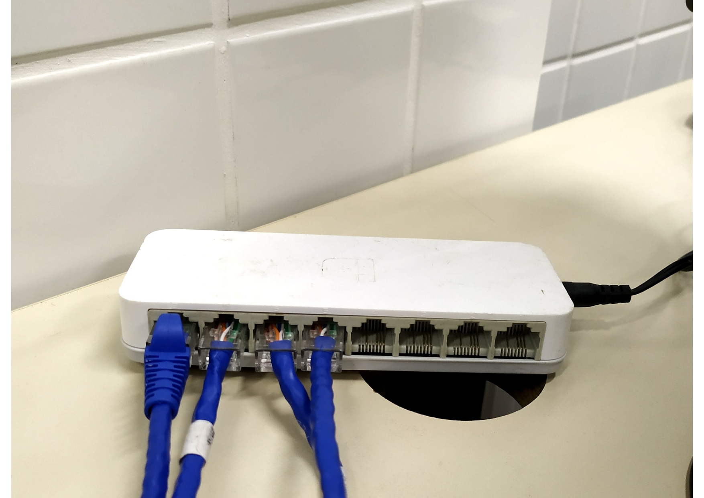

# Topologia Física
### Imagens referentes a estrutura física da rede montada

## PC1

 Figura 1: PC1 Natália

 

## PC2

 Figura 2: PC2 Rafaela

 
     
## PC3

 Figura 3: PC3 Louise

 

## PC4

 Figura 4: PC4 Evelly

     
     
## Cabos de rede conectados no PC1 e PC2

 Figura 5: Cabos de rede conectados no PC1 e PC2

 

## Cabos de rede conectados no PC3 e PC4

 Figura 6: Cabos de rede conectados no PC3 e PC4

  
     
## Cabos de rede conectados no switch

 Figura 7: Cabos de rede conectados no switch

 
     
## Switch conectado à tomada

 Figura 8: Switch conectado à tomada

 
